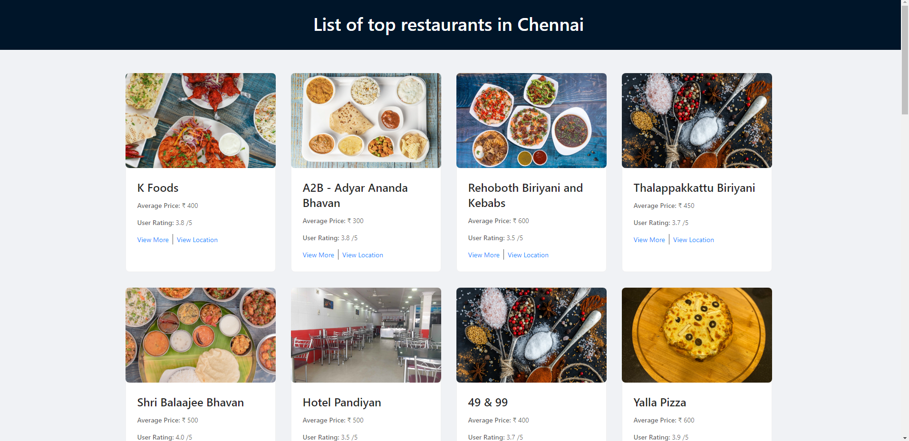

# Top Restaurants of a city

A Static Site generated using Gatsby and Zomato API
[Live Demo](https://quizzical-lalande.netlify.app/)

## Preview



## Features

- Gets Top Restaurant Details of a city by using Zomato API
- Shows Rating, Average Price of the Restaurant
- Gets Google Map Direction of Restaurant
- Link to Zomato Page of the Restaurant
- Fully Responsive Design

## Pre-requisites

Make sure you have installed the following on your development machine:

- Node.js - [Download & install Node.js](https://nodejs.org/en/download/) and npm package manager.
- Gatsby - Install [Gatsby](https://www.gatsbyjs.org/) by using npm:

```
$ npm install gatsby-cli -g
```

## Development Setup

1. Clone the repository
```
$ git clone https://github.com/fyrepenguin/gatsby-zomato.git
```
2. Get the API key from [ZOMATO](https://developers.zomato.com/api)
3. Create a .env file in the project root folder and add the key you got from Zomato as

```
ZOMATO_API_KEY=YOUR_API_KEY
```

4. Go the project root directory in terminal & install all the packages necessary using:

```
$ npm install
```
## How to Run
1. Run the project by using:

```
$ gatsby develop
```

2. Run the tests by using:

```
$ npm test
```

## Tech Stack Used

- [Gatsby](https://www.gatsbyjs.org/)
- [Jest](https://jestjs.io/)
- [Ant Design](https://ant.design/docs/react/introduce)

## Deployment

You can deploy to Netlify [automatically](https://www.netlify.com/blog/2016/09/29/a-step-by-step-guide-deploying-on-netlify/) from github or you can use netlify-cli to deploy [manually](https://www.netlify.com/blog/2019/05/28/deploy-in-seconds-with-netlify-cli/)

## Misc

You can get you city id from [Zomato API](https://developers.zomato.com/documentation#!/common/cities) and change the value in entity_id to your city id and get the top restaurants from your city.

```js
// in your gatsby-node.js
 params: {
      "entity_id": your_city_id,
    }
```
